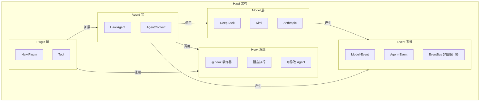

# Hawi 文档

Hawi Agent 框架的官方文档。

## 快速开始

- [快速入门指南](./quickstart.md) - 5 分钟上手 Hawi

## 文档索引

### 核心系统

| 文档 | 说明 |
|------|------|
| [architecture.md](./architecture.md) | Hawi 架构概览和设计原则 |
| [event_system.md](./event_system.md) | Event 系统使用指南 |
| [event_system_design.md](./event_system_design.md) | Event 系统设计决策 |
| [hook_system.md](./hook_system.md) | Hook 系统使用指南 |
| [models.md](./models.md) | 模型适配器使用指南 |
| [tools.md](./tools.md) | 工具系统使用指南 |
| [STREAMING_SUPPORT_PLAN.md](./STREAMING_SUPPORT_PLAN.md) | 流式支持设计计划 |

## 快速导航

### 事件系统 (Event)

Event 是**只读、非阻塞**的观察机制：

```python
from hawi.agent.events import EventBus, create_event_printer

bus = EventBus()
bus.subscribe(create_event_printer())

async for event in agent.arun("prompt", event_bus=bus):
    pass
```

### 钩子系统 (Hook)

Hook 是**阻塞、可修改**的干预机制：

```python
from hawi.plugin import HawiPlugin
from hawi.plugin.decorators import hook

class MyPlugin(HawiPlugin):
    @hook("before_tool_calling")
    async def on_tool_call(self, agent, tool_name, arguments):
        # 可以修改参数或取消调用
        arguments["timeout"] = 30
```

## 架构概览


