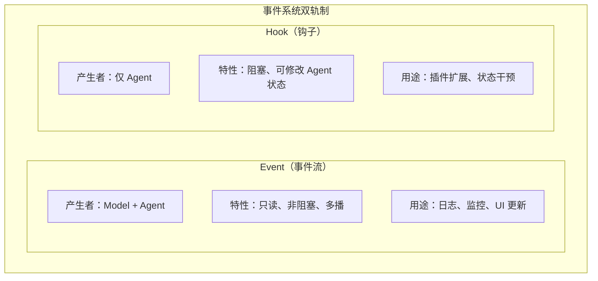
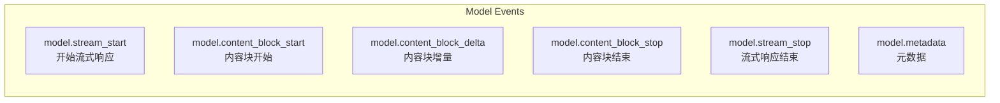
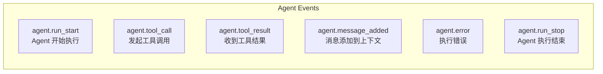
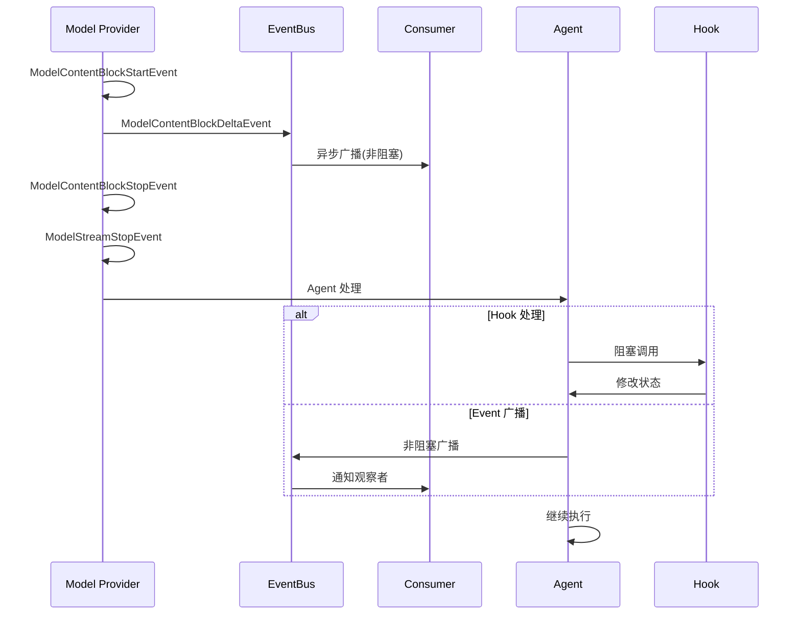
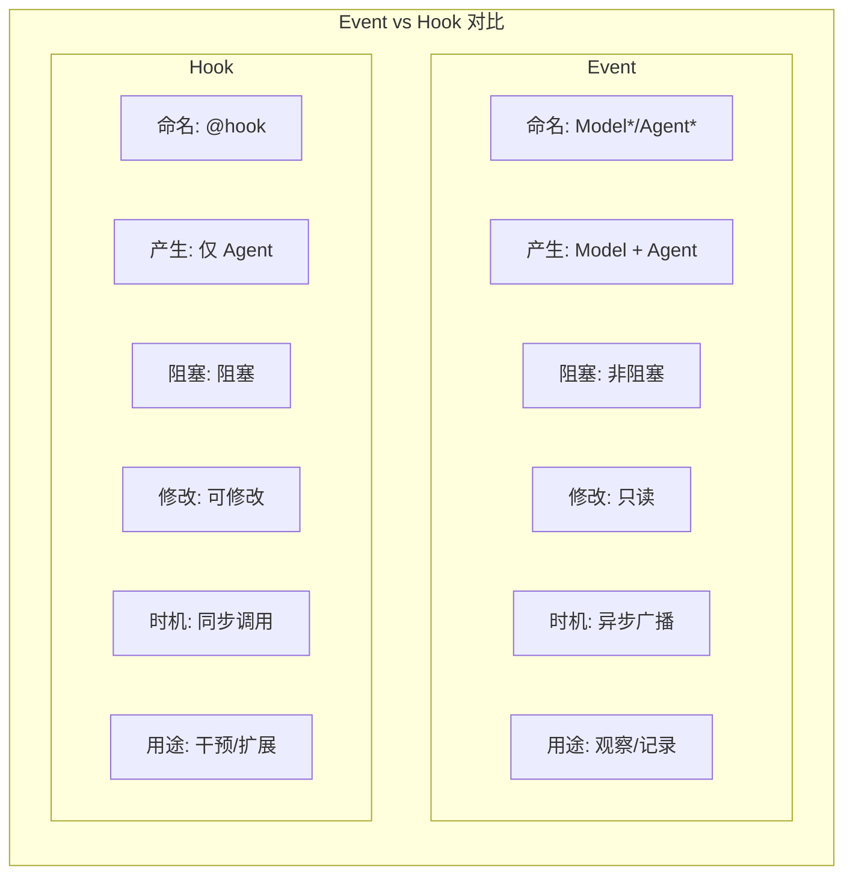

# Hawi Event System 事件系统

## 概述

Hawi 的事件系统采用**双轨制设计**：

- **Event（事件）**：只读、非阻塞，用于观察系统运行状态
- **Hook（钩子）**：阻塞、可修改，用于干预系统行为



## 快速开始

### 基本使用

```python
import asyncio
from hawi.agent import HawiAgent
from hawi.agent.events import EventBus, create_event_printer

async def main():
    # 创建事件总线和打印机
    event_bus = EventBus()
    event_bus.subscribe(create_event_printer())

    # 创建 Agent
    agent = HawiAgent(model=model, plugins=[MyPlugin()])

    # 流式执行，事件自动广播
    async for event in agent.arun("Hello", event_bus=event_bus):
        pass  # 事件已通过 event_bus 广播

asyncio.run(main())
```

### 使用 ConversationPrinter

`ConversationPrinter` 是一个高层的对话输出工具，自动处理各种事件并格式化输出：

```python
import asyncio
from hawi.agent import HawiAgent
from hawi.agent.events import ConversationPrinter

async def main():
    agent = HawiAgent(model=model, plugins=[MyPlugin()])

    # 创建打印机（支持配置）
    printer = ConversationPrinter(
        show_reasoning=True,      # 显示思考内容
        show_tools=True,          # 显示工具调用
        show_errors=True,         # 显示错误
        reasoning_prefix="\n🤔 ", # 思考内容前缀
        tool_call_prefix="\n🔧 ", # 工具调用前缀
        max_arg_length=50,        # 参数最大显示长度
    )

    # 流式处理事件
    async for event in agent.arun("计算 1+1", stream=True):
        await printer.handle(event)

asyncio.run(main())
```

**输出示例**：
```
🤔 让我计算一下 1+1 的结果
🔧 execute({'code': '1+1'})
✓ execute (45ms): 2
答案是 2
```

### 同步代码中使用

在同步代码（如 REPL）中使用 `ConversationPrinter`：

```python
from hawi.agent import HawiAgent, ConversationPrinter
import asyncio

agent = HawiAgent(model=model)
printer = ConversationPrinter()

# 同步方式运行
async def process(prompt):
    async for event in agent.arun(prompt, stream=True):
        await printer.handle(event)

# 使用 asyncio.run 执行
asyncio.run(process("Hello"))
```

### 自定义事件处理器

```python
async def my_handler(event: Event) -> None:
    """自定义事件处理器"""
    if event.type == "model.content_block_delta":
        delta = event.metadata.get("delta", "")
        print(f"收到内容: {delta}")
    elif event.type == "agent.tool_call":
        tool_name = event.metadata.get("tool_name")
        print(f"调用工具: {tool_name}")

# 订阅特定事件类型
bus = EventBus()
bus.subscribe(my_handler, event_types=[
    "model.content_block_delta",
    "agent.tool_call",
])
```

## 事件类型

### Model 事件（由 Model 产生）



### Agent 事件（由 Agent 产生）



## 架构设计

### 事件流程



### Event vs Hook 对比



### 代码示例对比

```python
# ========== Event 示例（非阻塞、只读）==========
from hawi.agent.events import Event, EventBus

async def log_event(event: Event) -> None:
    # 只读，不能修改
    print(f"[{event.timestamp}] {event.type}")
    # event.type = "xxx"  # ❌ 错误：frozen dataclass

bus = EventBus()
bus.subscribe(log_event)

# 发布事件（不等待消费者）
await bus.publish(event)  # 立即返回，后台执行消费者


# ========== Hook 示例（阻塞、可修改）==========
from hawi.plugin import HawiPlugin
from hawi.plugin.decorators import hook

class MyPlugin(HawiPlugin):
    @hook("before_tool_calling")
    async def on_tool_call(self, agent, tool_name, arguments):
        # 可以修改 Agent 状态
        agent.context.add_message({...})  # ✅ 可以修改
        arguments["extra"] = "value"  # ✅ 可以修改参数
```

## API 参考

### Event 类

```python
@dataclass(frozen=True, slots=True)
class Event:
    type: str                    # 事件类型
    source: Literal["model", "agent"]  # 事件来源
    timestamp: float             # 时间戳
    metadata: dict[str, Any]     # 元数据（事件特定数据）
```

### EventBus 类

```python
class EventBus:
    def subscribe(
        self,
        callback: Callable[[Event], Coroutine],
        event_types: list[str] | None = None
    ) -> None:
        """订阅事件"""

    def unsubscribe(
        self,
        callback: Callable[[Event], Coroutine],
        event_types: list[str] | None = None
    ) -> bool:
        """取消订阅"""

    async def publish(self, event: Event) -> None:
        """发布事件（异步广播，非阻塞）"""

    def close(self) -> None:
        """关闭事件总线"""
```

### ConversationPrinter 类

高层的对话输出格式化工具，自动处理各种事件并打印到控制台。

```python
class ConversationPrinter:
    def __init__(
        self,
        *,
        show_reasoning: bool = True,          # 是否显示 reasoning 内容
        show_tools: bool = True,              # 是否显示工具调用
        show_errors: bool = True,             # 是否显示错误
        reasoning_prefix: str = "\n🤔 ",      # reasoning 前缀
        tool_call_prefix: str = "\n🔧 ",      # 工具调用前缀
        tool_result_prefix: str = "",         # 工具结果前缀
        error_prefix: str = "\n❌ ",          # 错误前缀
        max_arg_length: int = 50,             # 参数最大显示长度
        max_result_length: int = 100,        # 结果最大显示长度
    ) -> None:
        """初始化打印机"""

    async def handle(self, event: Event) -> None:
        """
        处理事件。主要入口点，可直接作为 EventHandler 使用。

        支持的事件：
        - model.content_block_start/stop/delta: 内容块生命周期
        - model.stream_start/stop: 流式响应开始/结束
        - agent.tool_call/result: 工具调用和结果
        - agent.error: 错误信息
        """
```

**使用示例**：

```python
# 方式一：直接处理事件流
printer = ConversationPrinter()
async for event in agent.arun("prompt", stream=True):
    await printer.handle(event)

# 方式二：作为 EventBus 处理器
bus = EventBus()
bus.subscribe(printer.handle)
async for event in agent.arun("prompt", event_bus=bus):
    pass

# 方式三：自定义配置（不显示 reasoning）
printer = ConversationPrinter(show_reasoning=False)
async for event in agent.arun("prompt", stream=True):
    await printer.handle(event)
```

### 便捷函数

```python
# 创建事件工厂函数
def model_stream_start_event(request_id: str, **metadata) -> Event: ...
def model_content_block_delta_event(
    request_id: str,
    block_index: int,
    delta_type: Literal["text", "reasoning", ...],
    delta: str,
    **metadata
) -> Event: ...
def agent_tool_call_event(
    run_id: str,
    tool_name: str,
    arguments: dict,
    tool_call_id: str,
    **metadata
) -> Event: ...
# ... 等

# 创建默认打印机
def create_event_printer() -> EventHandler:
    """创建默认控制台打印机，实时显示内容和工具调用"""
```

## 最佳实践

### 1. 事件处理器不应该阻塞

```python
# ✅ 好的做法：快速处理或异步 I/O
async def good_handler(event: Event) -> None:
    await log_to_db(event)  # 异步 I/O

# ❌ 坏的做法：阻塞操作
def bad_handler(event: Event) -> None:
    time.sleep(1)  # 阻塞！会影响主流程
```

### 2. 不要依赖事件顺序

```python
# ✅ 好的做法：每个事件独立处理
async def handler(event: Event) -> None:
    if event.type == "model.content_block_delta":
        buffer.append(event.metadata["delta"])
    elif event.type == "model.content_block_stop":
        process_buffer()

# ❌ 坏的做法：假设事件顺序
async def bad_handler(event: Event) -> None:
    if event.type == "model.content_block_delta":
        # 假设下一个事件一定是 stop
        # 可能有其他事件插入
```

### 3. 使用类型过滤避免不必要的处理

```python
# ✅ 好的做法：订阅特定类型
bus.subscribe(
    handler,
    event_types=["model.content_block_delta", "agent.tool_call"]
)

# ❌ 坏的做法：在处理器中过滤
async def handler(event: Event) -> None:
    if event.type in [...]:  # 效率低
        ...
bus.subscribe(handler)  # 接收所有事件
```

## 迁移指南

### 从旧版 events 迁移

旧版 (v1) → 新版 (v2):

```python
# 旧版
from hawi.agent.events import AgentEvent, message_event, TOOL_CALL

async for event in agent.run("prompt", stream=True):
    if event.type == TOOL_CALL:
        print(event.data["tool_name"])


# 新版
from hawi.agent.events import EventBus, create_event_printer

bus = EventBus()
bus.subscribe(create_event_printer())

async for event in agent.arun("prompt", event_bus=bus):
    # 事件已通过 bus 广播
    pass
```

## 相关文档

- [设计文档](./event_system_design.md) - 详细设计决策和架构说明
- [Hook 系统](./hook_system.md) - 阻塞式钩子系统文档
