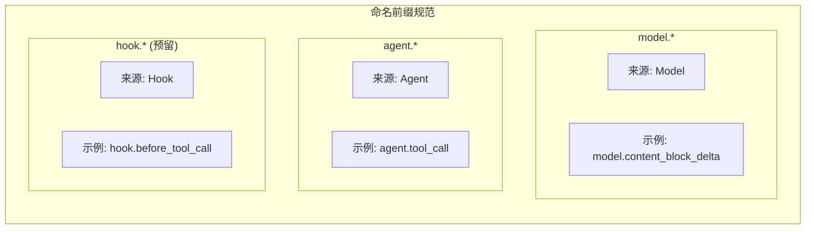
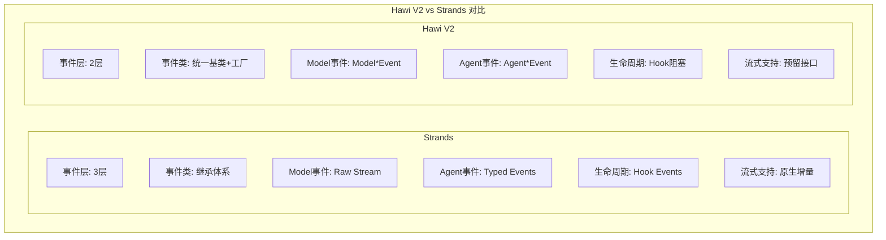

# Event System 设计文档

## 设计目标

1. **清晰分离关注点**：观察（Event）vs 干预（Hook）
2. **性能优先**：Event 不能阻塞主流程
3. **类型安全**：冻结 dataclass，防止意外修改
4. **易于理解**：Model*/Agent* 前缀明确事件来源

## 架构决策

### 决策 1：统一 Event 基类

**选项 A**：继承体系（Strands 风格）
```python
class StreamEvent(Event): ...
class TextDeltaEvent(StreamEvent): ...
class ReasoningDeltaEvent(StreamEvent): ...
```

**选项 B**：统一基类 + 工厂函数（选中）
```python
@dataclass(frozen=True)
class Event:
    type: str
    metadata: dict

def model_content_block_delta_event(...) -> Event: ...
```

**理由**：
- Python 的 dataclass 继承有默认值限制问题
- 统一基类更简单，metadata 可以灵活扩展
- 工厂函数提供类型提示和文档

### 决策 2：非阻塞广播

**实现**：使用 `asyncio.create_task()`

```python
async def publish(self, event: Event) -> None:
    for callback in callbacks:
        asyncio.create_task(self._invoke_safe(callback, event))
```

**为什么不等待？**
- Event 是观察性质，不应该影响主流程
- 慢消费者不应该拖累快生产者
- Hook 系统已经提供了阻塞干预能力

**错误处理**：
- 每个消费者独立捕获异常
- 异常不影响其他消费者
- 异常不影响主流程

### 决策 3：frozen dataclass

```python
@dataclass(frozen=True, slots=True)
class Event:
    ...
```

**理由**：
- 防止消费者意外修改事件
- 内存高效（slots）
- 可哈希（可用于去重等场景）

### 决策 4：命名前缀



**理由**：
- 明确事件来源
- 便于过滤和路由
- 避免命名冲突

## 与 Strands 的对比



## 预留扩展

### 增量流式支持

当前 Model 返回完整响应后产生 Event，未来可支持真正的增量流式：

```python
# 当前（完整响应）
response = await model.ainvoke(...)
for part in response.content:
    yield model_content_block_delta_event(...)

# 未来（增量流式）
async for chunk in model.astream(...):
    yield model_content_block_delta_event(
        delta=chunk.delta,
        ...
    )
```

### 事件持久化

```python
class PersistentEventBus(EventBus):
    async def publish(self, event: Event) -> None:
        # 先持久化
        await self.store.save(event)
        # 再广播
        await super().publish(event)
```

### 事件过滤链

```python
class FilteredEventBus(EventBus):
    def __init__(self, filter_fn: Callable[[Event], bool]):
        self.filter_fn = filter_fn

    async def publish(self, event: Event) -> None:
        if self.filter_fn(event):
            await super().publish(event)
```

## 性能考虑

1. **内存**：使用 `slots=True`，每个 Event 约 72 字节
2. **创建速度**：工厂函数比类实例化略快
3. **广播速度**：`asyncio.create_task` 开销小，适合高频事件
4. **背压**：当前无背压控制，消费者应该快速处理或自行缓冲

## 线程安全

EventBus 当前是单线程设计（asyncio）。如需线程安全：

```python
class ThreadSafeEventBus(EventBus):
    def __init__(self):
        super().__init__()
        self._lock = asyncio.Lock()

    async def publish(self, event: Event) -> None:
        async with self._lock:
            await super().publish(event)
```
