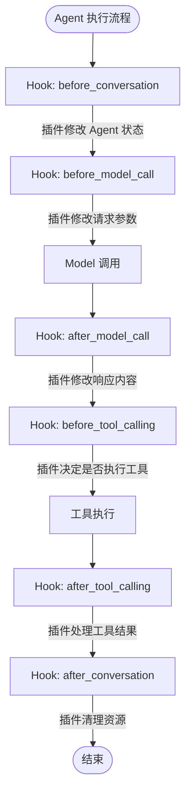
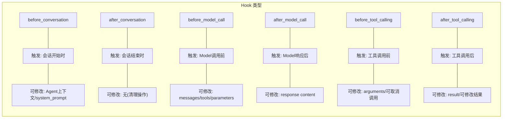
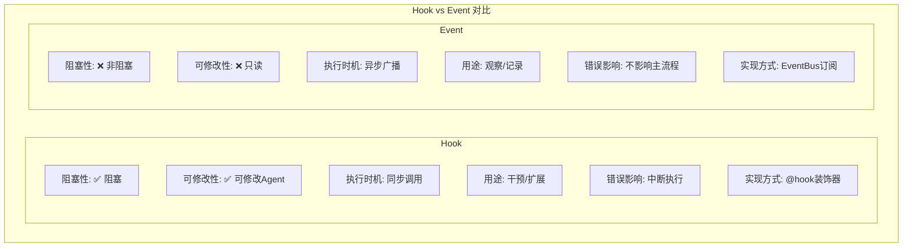

# Hook System 钩子系统

## 概述

Hook 是 Hawi 提供的**阻塞式、可修改**的扩展机制。与 Event 不同，Hook 可以：

- 阻塞 Agent 执行直到处理完成
- 读取和修改 Agent 状态
- 干预工具调用参数和结果

## 核心概念



## Hook 类型



## 使用方法

### 基础插件

```python
from hawi.plugin import HawiPlugin
from hawi.plugin.decorators import hook

class MyPlugin(HawiPlugin):
    """示例插件"""

    @hook("before_conversation")
    async def on_start(self, agent):
        """会话开始时执行"""
        print(f"会话开始，当前消息数: {len(agent.context.messages)}")

    @hook("after_conversation")
    async def on_end(self, agent):
        """会话结束时执行"""
        print("会话结束")
```

### 干预工具调用

```python
class ToolInterventionPlugin(HawiPlugin):
    """干预工具调用的示例"""

    @hook("before_tool_calling")
    async def on_before_tool(self, agent, tool_name, arguments):
        """
        在工具调用前执行。

        可以：
        1. 修改参数
        2. 记录日志
        3. 取消调用（抛出异常）
        """
        print(f"即将调用工具: {tool_name}")
        print(f"参数: {arguments}")

        # 修改参数
        if tool_name == "execute":
            arguments["timeout"] = 30  # 添加超时限制

    @hook("after_tool_calling")
    async def on_after_tool(self, agent, tool_name, arguments, result):
        """
        在工具调用后执行。

        可以：
        1. 修改结果
        2. 记录执行时间
        3. 错误处理
        """
        print(f"工具 {tool_name} 执行完成")
        print(f"结果: {result.output[:100]}")

        # 修改结果（例如脱敏）
        if "password" in result.output:
            result.output = result.output.replace("password", "***")
```

### 修改 Model 请求

```python
class ModelInterceptorPlugin(HawiPlugin):
    """拦截和修改 Model 请求"""

    @hook("before_model_call")
    async def on_before_model(self, agent, context, model):
        """
        在 Model 调用前执行。

        可以修改：
        - context.messages
        - context.system_prompt
        - context.tools
        """
        # 添加额外的系统提示
        if agent.context.system_prompt:
            agent.context.system_prompt += "\n注意：请使用中文回答。"

    @hook("after_model_call")
    async def on_after_model(self, agent, context, response):
        """
        在 Model 响应后执行。

        可以修改响应内容。
        """
        # 检查响应内容
        for part in response.content:
            if part.get("type") == "text":
                text = part.get("text", "")
                # 添加后处理
                if "敏感词" in text:
                    part["text"] = text.replace("敏感词", "***")
```

## Hook 与 Event 的区别



## 执行顺序

多个插件注册同一 Hook 时，按注册顺序执行：

```python
agent = HawiAgent(
    plugins=[PluginA(), PluginB(), PluginC()]
)

# before_model_call 执行顺序：
# 1. PluginA.on_before_model
# 2. PluginB.on_before_model
# 3. PluginC.on_before_model
```

## 错误处理

Hook 中的异常会中断 Agent 执行：

```python
class FailingPlugin(HawiPlugin):
    @hook("before_tool_calling")
    async def on_before_tool(self, agent, tool_name, arguments):
        if tool_name == "dangerous":
            raise RuntimeError("禁止调用危险工具！")

# 当调用 dangerous 工具时：
# 1. 抛出 RuntimeError
# 2. Agent 执行中断
# 3. 返回错误结果
```

## 与 Event 配合使用

```python
class ComprehensivePlugin(HawiPlugin):
    """同时使用 Hook 和 Event 的示例"""

    def __init__(self):
        self.event_bus = EventBus()
        self.event_bus.subscribe(self._on_event)

    async def _on_event(self, event: Event):
        """异步处理 Event（不阻塞）"""
        if event.type == "agent.tool_call":
            await self.log_to_remote(event)

    @hook("before_tool_calling")
    async def on_before_tool(self, agent, tool_name, arguments):
        """同步干预工具调用（阻塞）"""
        # 实时决策，可能需要阻塞
        if not await self.check_permission(tool_name):
            raise PermissionError(f"无权使用 {tool_name}")
```

## 最佳实践

### 1. 保持 Hook 轻量

```python
# ✅ 好的做法：快速决策
@hook("before_tool_calling")
async def on_before_tool(self, agent, tool_name, arguments):
    if tool_name in self.blocked_tools:
        raise ValueError(f"工具 {tool_name} 被禁用")

# ❌ 坏的做法：耗时操作
@hook("before_tool_calling")
async def on_before_tool(self, agent, tool_name, arguments):
    await asyncio.sleep(5)  # 阻塞 Agent 5 秒！
```

### 2. 明确修改范围

```python
@hook("after_model_call")
async def on_after_model(self, agent, context, response):
    # ✅ 只修改必要的内容
    for part in response.content:
        if part.get("type") == "text":
            # 添加水印
            part["text"] += "\n\n[由 AI 生成]"
```

### 3. 异常处理

```python
@hook("before_tool_calling")
async def on_before_tool(self, agent, tool_name, arguments):
    try:
        # 可能失败的操作
        await self.validate(arguments)
    except ValidationError as e:
        # 转换为 Agent 可理解的错误
        raise ToolCallError(f"参数验证失败: {e}") from e
```

## 完整示例

```python
from hawi.agent import HawiAgent
from hawi.plugin import HawiPlugin
from hawi.plugin.decorators import hook

class LoggingPlugin(HawiPlugin):
    """完整的日志记录插件"""

    def __init__(self):
        self.call_count = 0
        self.tool_stats = {}

    @hook("before_conversation")
    async def on_start(self, agent):
        print(f"🚀 会话开始")
        self.call_count = 0

    @hook("before_model_call")
    async def on_before_model(self, agent, context, model):
        self.call_count += 1
        print(f"🤖 第 {self.call_count} 次 Model 调用")

    @hook("before_tool_calling")
    async def on_before_tool(self, agent, tool_name, arguments):
        print(f"🔧 调用工具: {tool_name}")
        self.tool_stats[tool_name] = self.tool_stats.get(tool_name, 0) + 1

    @hook("after_tool_calling")
    async def on_after_tool(self, agent, tool_name, arguments, result):
        status = "✅" if result.success else "❌"
        print(f"{status} 工具 {tool_name} 执行完成")

    @hook("after_conversation")
    async def on_end(self, agent):
        print(f"🏁 会话结束")
        print(f"   Model 调用次数: {self.call_count}")
        print(f"   工具使用统计: {self.tool_stats}")

# 使用
agent = HawiAgent(
    model=model,
    plugins=[LoggingPlugin()]
)

result = agent.run("计算 1+1")
```

输出：
```
🚀 会话开始
🤖 第 1 次 Model 调用
🔧 调用工具: calculate
✅ 工具 calculate 执行完成
🤖 第 2 次 Model 调用
🏁 会话结束
   Model 调用次数: 2
   工具使用统计: {'calculate': 1}
```
