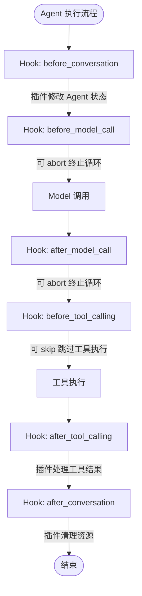

# Hook System 钩子系统

## 概述

Hook 是 Hawi 提供的**阻塞式、可修改**的扩展机制。与 Event 不同，Hook 可以：

- 阻塞 Agent 执行直到处理完成
- 读取和修改 Agent 状态
- 干预工具调用参数和结果
- **返回 `HookResult` 控制 Agent 流程**（跳过工具执行、提前终止循环）

## 核心概念


```mermaid
flowchart TD
    Start(["Agent 执行流程"]) --> BC["Hook: before_conversation"]
    BC -->|"插件修改 Agent 状态"| BMC["Hook: before_model_call"]
    BMC -->|"可 abort 终止循环"| Model["Model 调用"]
    Model --> AMC["Hook: after_model_call"]
    AMC -->|"可 abort 终止循环"| BTC["Hook: before_tool_calling"]
    BTC -->|"可 skip 跳过工具执行"| Tool["工具执行"]
    Tool --> ATC["Hook: after_tool_calling"]
    ATC -->|"插件处理工具结果"| AEC["Hook: after_conversation"]
    AEC -->|"插件清理资源"| End(["结束"])
```

## 使用方法

Hook 必须定义在 `HawiPlugin` 子类中（不支持独立函数）。每种 Hook 通过装饰器标记，并接受 `HookContext` 作为最后一个参数。

```python
from hawi.plugin import HawiPlugin, HookContext, HookResult
from hawi.plugin.decorators import before_conversation, after_conversation

class MyPlugin(HawiPlugin):
    @before_conversation
    async def on_start(self, agent, ctx: HookContext):
        print(f"[{ctx.run_id}] 会话开始，iteration={ctx.iteration}")

    @after_conversation
    async def on_end(self, agent, ctx: HookContext):
        if ctx.usage:
            print(f"本次消耗 Token: {ctx.usage['input_tokens']} in / {ctx.usage['output_tokens']} out")
        if ctx.error:
            print(f"执行出错: {ctx.error}")
```

## HookContext

每次 Hook 调用都会收到一个 `HookContext` 对象（最后一个参数）。

```python
@dataclass(frozen=True)
class HookContext:
    run_id: str               # 本次 arun() 的唯一 ID
    iteration: int            # 当前循环轮次（session/conversation 级钩子 = 0）
    tool_call_id: str | None  # 工具调用 ID（tool 类钩子专用）
    tool: AgentTool | None    # 工具对象本体（tool 类钩子专用）
    duration_ms: float | None # 执行耗时（after 类钩子）
    usage: TokenUsage | None  # 本轮 token 用量
    stop_reason: str | None   # 停止原因（after_model_call / after_conversation）
    error: Exception | None   # 错误（after_conversation / after_session）
```

各 Hook 的有效 `ctx` 字段：

| Hook | 有效字段 |
|------|---------|
| `before_session` | `run_id` |
| `after_session` | `run_id`, `duration_ms`, `error` |
| `before_conversation` | `run_id` |
| `after_conversation` | `run_id`, `duration_ms`, `usage`, `stop_reason`, `error` |
| `before_model_call` | `run_id`, `iteration`, `usage`（累计值） |
| `after_model_call` | `run_id`, `iteration`, `duration_ms`, `usage`, `stop_reason` |
| `before_tool_calling` | `run_id`, `iteration`, `tool_call_id`, `tool` |
| `after_tool_calling` | `run_id`, `iteration`, `tool_call_id`, `tool`, `duration_ms` |

## HookResult — 流程控制

Hook 可以通过返回 `HookResult` 来控制 Agent 流程。返回 `None` 表示继续正常执行。

```python
from hawi.plugin import HookResult
from hawi.tool.types import ToolResult
```

### 跳过工具执行（skip）

在 `before_tool_calling` 中返回 `HookResult.skip(result)`，用 synthetic result 替代实际执行：

```python
@before_tool_calling
async def cache_get(self, agent, tool_name, arguments, ctx: HookContext):
    key = f"{tool_name}:{arguments}"
    if key in self._cache:
        return HookResult.skip(self._cache[key])  # 跳过执行，返回缓存结果
```

### 提前终止 Agent 循环（abort）

在任意 Hook 中返回 `HookResult.abort(reason)`，提前结束 Agent run：

```python
@before_model_call
async def budget_guard(self, agent, context, model, ctx: HookContext):
    if ctx.usage and ctx.usage["input_tokens"] > 40_000:
        return HookResult.abort("token budget exceeded")
```

终止后，`AgentRunResult.stop_reason == "hook_abort"`。

### Hook Chain 执行规则

多个插件注册同一 Hook 类型时，按注册顺序依次执行：

- 返回 `None` → 继续执行链中的下一个 Hook。
- 返回 `HookResult` → **链立即停止**，后续 Hook 不再执行。

```python
agent = HawiAgent(
    plugins=[PluginA(), PluginB(), PluginC()]
)
# before_model_call 执行顺序：
# 1. PluginA.before_model_call → None → 继续
# 2. PluginB.before_model_call → HookResult.abort() → 链停止
# 3. PluginC.before_model_call → 不执行
```

## Hook 类型完整签名

```python
from hawi.plugin.decorators import (
    before_session,       # (self, agent, ctx)
    after_session,        # (self, agent, ctx)
    before_conversation,  # (self, agent, ctx)
    after_conversation,   # (self, agent, ctx)
    before_model_call,    # (self, agent, context, model, ctx)
    after_model_call,     # (self, agent, context, response, ctx)
    before_tool_calling,  # (self, agent, tool_name, arguments, ctx) → HookResult | None
    after_tool_calling,   # (self, agent, tool_name, arguments, result, ctx)
)
```

所有 Hook 均可返回 `HookResult | None`（同步或异步均可）。

## 异常处理

- Hook 中的**普通异常直接中断 Agent 执行**（透传到调用方，不会被静默捕获）。
- 可预期的"拒绝"请使用 `HookResult.skip()`；"终止运行"请使用 `HookResult.abort()`。

```python
@before_tool_calling
async def permission_check(self, agent, tool_name, arguments, ctx: HookContext):
    if not await self.has_permission(tool_name):
        # ✅ 拒绝工具调用，给 LLM 一个错误结果
        return HookResult.skip(ToolResult(success=False, output={"error": f"Permission denied: {tool_name}"}))

    if tool_name == "shutdown":
        # ✅ 立即终止整个 Agent run
        return HookResult.abort("shutdown tool called")

    # ❌ 不要用异常来"拒绝"——异常会中断整个 Agent，而不是返回错误给 LLM
```

## 实用示例

### 精确计费

```python
class BillingPlugin(HawiPlugin):
    def __init__(self, billing_client):
        self.billing = billing_client

    @after_conversation
    async def charge(self, agent, ctx: HookContext):
        if ctx.usage:
            await self.billing.record(
                run_id=ctx.run_id,
                input_tokens=ctx.usage["input_tokens"],
                output_tokens=ctx.usage["output_tokens"],
            )
```

### 工具缓存

```python
class CachePlugin(HawiPlugin):
    def __init__(self):
        self._cache: dict = {}

    @before_tool_calling
    def cache_get(self, agent, tool_name, arguments, ctx: HookContext):
        key = f"{tool_name}:{sorted(arguments.items())}"
        if key in self._cache:
            return HookResult.skip(self._cache[key])

    @after_tool_calling
    def cache_set(self, agent, tool_name, arguments, result, ctx: HookContext):
        if result.success:
            key = f"{tool_name}:{sorted(arguments.items())}"
            self._cache[key] = result
```

### 工具执行统计

```python
class StatsPlugin(HawiPlugin):
    def __init__(self):
        self.tool_durations: dict[str, list[float]] = {}

    @after_tool_calling
    def record_duration(self, agent, tool_name, arguments, result, ctx: HookContext):
        if ctx.duration_ms is not None:
            self.tool_durations.setdefault(tool_name, []).append(ctx.duration_ms)

    def report(self):
        for name, durations in self.tool_durations.items():
            avg = sum(durations) / len(durations)
            print(f"{name}: avg={avg:.1f}ms, calls={len(durations)}")
```

### 动态 System Prompt 注入

```python
class ContextPlugin(HawiPlugin):
    def __init__(self, user_id: str):
        self.user_id = user_id

    @before_conversation
    async def inject(self, agent, ctx: HookContext):
        prefs = await self.load_user_prefs(self.user_id)
        agent.context.system_prompt.append({
            "type": "text",
            "text": f"\n用户偏好: {prefs}"
        })
```

## Hook 与 Event 的区别

| 特性 | Hook | Event |
|------|------|-------|
| 阻塞性 | ✅ 阻塞执行 | ❌ 非阻塞（worker 线程） |
| 可修改性 | ✅ 可修改 Agent 状态 | ❌ 只读（frozen Pydantic 模型） |
| 执行顺序 | 链式，可中途停止 | 广播，所有订阅者都执行 |
| 流程控制 | ✅ 可 skip/abort | ❌ 无 |
| 消费者数量 | 多个（chain） | 多个（broadcast） |
| 错误处理 | 透传，中断执行 | 捕获，不影响主流程 |
| 适用场景 | 干预、扩展 | 观察、记录 |
